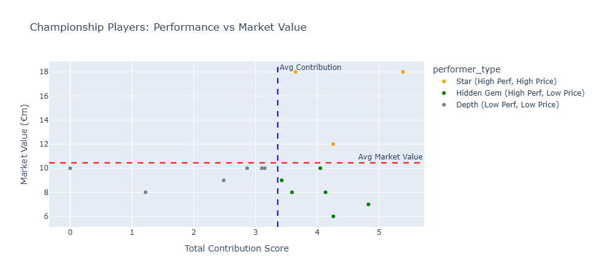
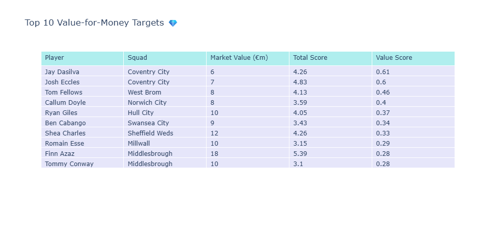

# EFL Championship 2025-26: Unearthing Hidden Gems 💎

Football isn't just played on the pitch; it's won in the transfer market. In a league as notoriously gruelling and competitive as the EFL Championship, the difference between promotion and mid-table mediocrity often comes down to finding that one overlooked player. 

This project is an advanced, automated data analysis pipeline dedicated to **finding hidden gems from EFL Championship clubs**. By crunching market values from Transfermarkt and underlying performance statistics from FBref, we systematically identify which players are undervalued relative to their output, and which ones are riding high on reputation alone.

---

### 📸 Project Dashboard Preview



*Plotly dashboard showing player contribution vs market value*



*Example: Top 10 Undervalued Gems based on Value-for-Money Score*

---

## 🏆 What It Delivers

- **Automated Data Engineering:** Scrapes, cleans, and merges messy real-world football data.
- **Smart Valuation:** Calculates an objective "Value-for-Money" metric based on a weighted formula (0.6 × Offensive + 0.4 × Defensive scores).
- **Interactive Visualizations:** Generates a stunning interactive Plotly HTML dashboard to explore the data dynamically.
- **Clean Artifacts:** Outputs a highly polished `final_ranked_players.csv` ready for immediate use.

---

## 🛠 Tech Stack & Architecture

This pipeline is built on a robust, decoupled architecture:

* **Language:** Python 3
* **Scraping Layer (`scraper.py`):** Utilizes **Playwright** with stealth configurations to handle modern anti-bot protections, with intelligent fallbacks (Wayback Machine).
* **Data Science Layer (`build_notebook.py` / Jupyter):** Uses `pandas` for aggressive data wrangling, handling multi-level headers, and `thefuzz` for intelligent fuzzy string matching across disparate datasets.
* **Visualization:** `plotly` for interactive, beautiful dashboarding.

**Folder Structure:**
```text
Championship/
├── scraper.py            # Live scraping layer (Playwright + Stealth)
├── requirements.txt      # Project dependencies
├── README.md             # You are here
├── data/                 
│   ├── raw/              # Scraped CSV inputs
│   ├── player_mapping.json # Manual TM→FBref name overrides
│   └── final_ranked_players.csv # The final pipeline output
├── notebooks/            # Generated Jupyter Notebooks
├── reports/              # HTML Dashboards & Outputs
```

---

## ✨ Key Features

- **Live Scraping First:** Employs Playwright to emulate real browsing, trying multiple domain variants (`.us`, `.com`) before safely falling back to archive proxies.
- **Dynamic Minutes Filter:** Automatically drops players who haven't played at least 25% of the league's maximum minutes so far, keeping the analysis relevant at any point in the season.
- **Fuzzy Matching on Steroids:** Employs a ≥75% fuzzy threshold and a manual JSON dictionary to perfectly bridge the gap between Transfermarkt's and FBref's differing name conventions.
- **Deduplication Guards:** Robust defenses against pagination quirks to ensure 1 player = 1 row.

---

## 🚀 How to Run

Want to find some hidden gems yourself?

1. **Install Dependencies:**
   ```bash
   pip install -r requirements.txt
   playwright install chromium
   ```
2. **Scrape the Latest Data:**
   ```bash
   python scraper.py
   ```
3. **Build the Analytics Engine:**
   ```bash
   python build_notebook.py
   ```
4. **Explore:** Open `notebooks/EFL_Championship_Analysis.ipynb` and run all cells, or open `reports/championship_dashboard.html` to view the finalized visual dashboard.

---

## 💡 Key Findings (Season 25/26)

Based on our final Value-for-Money calculations, the data revealed some fascinating market inefficiencies:

- **The Coventry City Value Engine (Jay Dasilva & Josh Eccles):** The algorithm identified Coventry's midfield and defensive flank as holding the highest "Value-for-Money" scores in the league. At just €7.0m, Josh Eccles generated a staggering 133 progressive passes over 22 90s. Similarly, Jay Dasilva (€6m) proved highly efficient in ball progression relative to his low valuation, marking them both as premier "Hidden Gems".
- **The Ball Carrier Supreme (Tom Fellows - West Brom):** Valued at a modest €8.0m, Fellows is a statistical anomaly. Producing a massive 121 progressive carries across 23.9 90s, his ability to single-handedly drive his team up the pitch far exceeds the output of wingers priced twice as high.
- **Validating the Premium Price Tag (Finn Azaz - Middlesbrough):** While we hunt for bargains, the pipeline also identifies true "Stars" who justify their heavy price tags. Valued at €18.0m, Azaz's underlying metrics (6.4 xG, 7.7 xAG, and 153 progressive passes) firmly place him in the top-right quadrant. He isn't overvalued; he's simply elite.

---

## 🧠 Why This Matters

In modern football analytics, descriptive stats only tell part of the story. Contextualizing performance *against market value* allows clubs to optimize tight budgets, outsmart wealthier rivals, and identify market inefficiencies. This project isn't just about code; it's a practical implementation of the "Moneyball" philosophy applied to the English second tier.

---

## 🧗 Challenges Overcome & What I Learned

Building a data pipeline from the ground up rarely goes exactly to plan. Here’s what it took to get this working smoothly:

- **Navigating the 403 Forbidden Walls:** Headless scraping is aggressively blocked by football stats sites. I had to evolve the scraper from a naive `requests` approach to a full Playwright stealth implementation, incorporating polite delays and domain hopping.
- **The Duplication Bug:** Discovered that Transfermarkt would silently return duplicate pages instead of a 404 when it ran out of players. Solved this by building a dynamic "seen-player" guard into the pagination loop.
- **Bridging the Name Gap:** Matching "Jesurun Rak-Sakyi" to "J. Rak-Sakyi" requires robust fuzzy matching, which I implemented using `thefuzz` and an override mapping dictionary.

⭐ If you find this project useful, give it a star! Questions or feedback? Open an issue or reach out.
